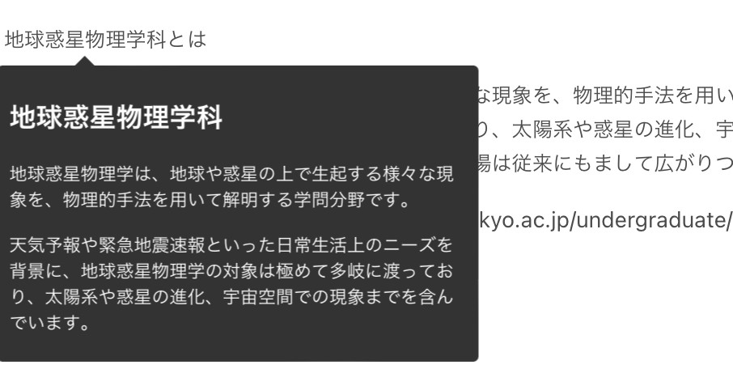

# HTMLファイルでホバーで解説を見られるようにする仮ツール

- 取得したHTMLファイルの一部を改変し、ユーザーが特定の文字列（用語）をホバーすると、その用語の解説を見られるようにするツール（仮）です。

- ユーザーはMarkdownをもちいて解説を作成します。

## 使ったパッケージ

- [@tippyjs/react](https://github.com/atomiks/tippyjs-react)
- [html-react-parser](https://github.com/remarkablemark/html-react-parser)
- [react-markdown](https://github.com/remarkjs/react-markdown)
## 主要ファイルとその役割

- `src/App.tsx`
  - ホバーして解説が読めるように`src/utils/convertHtml.tsx` (後述)によって改変されたhtmlファイルのデータを表示する部分。

- `public/test.md`
  - 解説作成のためにユーザーが入力する部分。

- `public/hoge.html`
  - html（本番環境では講義資料）の元データ

- `src/utils/mdModify.tsx`
  - `public/test.md` の解説データを、`src/utils/convertHtml.tsx` が利用できる形に変更する。

- `src/utils/convertHtml.tsx`
  - `public/hoge.html` 講義資料を、`src/utils/mdModify.tsx` を用いて、ホバーで解説が表示できるよう改変する。
